# 2017 Kaggle Machine Learning & Data Science Survey
***

## Context
Kaggle에서 데이터 사이언스나 머신러닝에 대한 설문 조사를 실시
 - 설문기간 : 2017.8.7 ~ 2017.8.25
 - 평균 응답 시간 : 16.4분
 - 171개 국가 및 지역에서 16,716명의 응답자
 - 특정 국가 또는 지역에서 응답자가 50명 미만인 경우 '기타' 그룹으로 그룹화
***

## Content
5개의 데이터 파일 제공
 - schema.csv : 설문 스키마가 있는 csv 파일로 multipleChoiceResponses.csv 및 freeformResponses.csv의 각 열 이름에 해당하는 질문 포함
 - multipleChoiceResponses.csv : 객관식 및 순위 질문에 대한 응답자의 답변
 - freeformResponses.csv : 설문 조사 질문에 대한 응답자의 주관식 답변
 - conversionRates.csv : 2017.9.14에 액세스한 통화 변환율 (USD)
 - RespondentTypeREADME.txt : schema.csv 파일의 "Asked"열에 응답을 디코딩하는 스키마
***


```python
import pandas as pd
import numpy as np
import matplotlib.pyplot as plt
import seaborn as sns
from scipy import stats

%matplotlib inline

import warnings
warnings.filterwarnings('ignore')
```


```python
question = pd.read_csv('dataset/schema.csv')
question.shape
```


    (290, 3)


```python
question.head()
```


<div>
<style scoped>
    .dataframe tbody tr th:only-of-type {
        vertical-align: middle;
    }

    .dataframe tbody tr th {
        vertical-align: top;
    }

    .dataframe thead th {
        text-align: right;
    }
</style>
<table border="1" class="dataframe">
  <thead>
    <tr style="text-align: right;">
      <th></th>
      <th>Column</th>
      <th>Question</th>
      <th>Asked</th>
    </tr>
  </thead>
  <tbody>
    <tr>
      <td>0</td>
      <td>GenderSelect</td>
      <td>Select your gender identity. - Selected Choice</td>
      <td>All</td>
    </tr>
    <tr>
      <td>1</td>
      <td>GenderFreeForm</td>
      <td>Select your gender identity. - A different ide...</td>
      <td>All</td>
    </tr>
    <tr>
      <td>2</td>
      <td>Country</td>
      <td>Select the country you currently live in.</td>
      <td>All</td>
    </tr>
    <tr>
      <td>3</td>
      <td>Age</td>
      <td>What's your age?</td>
      <td>All</td>
    </tr>
    <tr>
      <td>4</td>
      <td>EmploymentStatus</td>
      <td>What's your current employment status?</td>
      <td>All</td>
    </tr>
  </tbody>
</table>
</div>


```python
# 16,716명의 응답자
mcq = pd.read_csv('dataset/multipleChoiceResponses.csv',
                 encoding='ISO-8859-1', low_memory=False)
mcq.shape
```


    (16716, 228)


```python
mcq.columns
```


    Index(['GenderSelect', 'Country', 'Age', 'EmploymentStatus', 'StudentStatus',
           'LearningDataScience', 'CodeWriter', 'CareerSwitcher',
           'CurrentJobTitleSelect', 'TitleFit',
           ...
           'JobFactorExperienceLevel', 'JobFactorDepartment', 'JobFactorTitle',
           'JobFactorCompanyFunding', 'JobFactorImpact', 'JobFactorRemote',
           'JobFactorIndustry', 'JobFactorLeaderReputation', 'JobFactorDiversity',
           'JobFactorPublishingOpportunity'],
          dtype='object', length=228)


```python
mcq.tail(10)
```


<div>
<style scoped>
    .dataframe tbody tr th:only-of-type {
        vertical-align: middle;
    }

    .dataframe tbody tr th {
        vertical-align: top;
    }

    .dataframe thead th {
        text-align: right;
    }
</style>
<table border="1" class="dataframe">
  <thead>
    <tr style="text-align: right;">
      <th></th>
      <th>GenderSelect</th>
      <th>Country</th>
      <th>Age</th>
      <th>EmploymentStatus</th>
      <th>StudentStatus</th>
      <th>LearningDataScience</th>
      <th>CodeWriter</th>
      <th>CareerSwitcher</th>
      <th>CurrentJobTitleSelect</th>
      <th>TitleFit</th>
      <th>...</th>
      <th>JobFactorExperienceLevel</th>
      <th>JobFactorDepartment</th>
      <th>JobFactorTitle</th>
      <th>JobFactorCompanyFunding</th>
      <th>JobFactorImpact</th>
      <th>JobFactorRemote</th>
      <th>JobFactorIndustry</th>
      <th>JobFactorLeaderReputation</th>
      <th>JobFactorDiversity</th>
      <th>JobFactorPublishingOpportunity</th>
    </tr>
  </thead>
  <tbody>
    <tr>
      <td>16706</td>
      <td>Male</td>
      <td>Australia</td>
      <td>NaN</td>
      <td>Employed full-time</td>
      <td>NaN</td>
      <td>NaN</td>
      <td>Yes</td>
      <td>NaN</td>
      <td>Other</td>
      <td>Poorly</td>
      <td>...</td>
      <td>NaN</td>
      <td>NaN</td>
      <td>NaN</td>
      <td>NaN</td>
      <td>NaN</td>
      <td>NaN</td>
      <td>NaN</td>
      <td>NaN</td>
      <td>NaN</td>
      <td>NaN</td>
    </tr>
    <tr>
      <td>16707</td>
      <td>Female</td>
      <td>Indonesia</td>
      <td>30.0</td>
      <td>Employed full-time</td>
      <td>NaN</td>
      <td>NaN</td>
      <td>Yes</td>
      <td>NaN</td>
      <td>NaN</td>
      <td>NaN</td>
      <td>...</td>
      <td>NaN</td>
      <td>NaN</td>
      <td>NaN</td>
      <td>NaN</td>
      <td>NaN</td>
      <td>NaN</td>
      <td>NaN</td>
      <td>NaN</td>
      <td>NaN</td>
      <td>NaN</td>
    </tr>
    <tr>
      <td>16708</td>
      <td>Male</td>
      <td>Indonesia</td>
      <td>21.0</td>
      <td>Employed full-time</td>
      <td>NaN</td>
      <td>NaN</td>
      <td>NaN</td>
      <td>NaN</td>
      <td>NaN</td>
      <td>NaN</td>
      <td>...</td>
      <td>NaN</td>
      <td>NaN</td>
      <td>NaN</td>
      <td>NaN</td>
      <td>NaN</td>
      <td>NaN</td>
      <td>NaN</td>
      <td>NaN</td>
      <td>NaN</td>
      <td>NaN</td>
    </tr>
    <tr>
      <td>16709</td>
      <td>Male</td>
      <td>People 's Republic of China</td>
      <td>34.0</td>
      <td>Employed full-time</td>
      <td>NaN</td>
      <td>NaN</td>
      <td>Yes</td>
      <td>NaN</td>
      <td>DBA/Database Engineer</td>
      <td>Poorly</td>
      <td>...</td>
      <td>NaN</td>
      <td>NaN</td>
      <td>NaN</td>
      <td>NaN</td>
      <td>NaN</td>
      <td>NaN</td>
      <td>NaN</td>
      <td>NaN</td>
      <td>NaN</td>
      <td>NaN</td>
    </tr>
    <tr>
      <td>16710</td>
      <td>Male</td>
      <td>People 's Republic of China</td>
      <td>23.0</td>
      <td>Not employed, but looking for work</td>
      <td>NaN</td>
      <td>NaN</td>
      <td>NaN</td>
      <td>NaN</td>
      <td>NaN</td>
      <td>NaN</td>
      <td>...</td>
      <td>NaN</td>
      <td>NaN</td>
      <td>NaN</td>
      <td>NaN</td>
      <td>NaN</td>
      <td>NaN</td>
      <td>NaN</td>
      <td>NaN</td>
      <td>NaN</td>
      <td>NaN</td>
    </tr>
    <tr>
      <td>16711</td>
      <td>Female</td>
      <td>Other</td>
      <td>24.0</td>
      <td>Not employed, but looking for work</td>
      <td>NaN</td>
      <td>NaN</td>
      <td>NaN</td>
      <td>NaN</td>
      <td>NaN</td>
      <td>NaN</td>
      <td>...</td>
      <td>NaN</td>
      <td>NaN</td>
      <td>NaN</td>
      <td>NaN</td>
      <td>NaN</td>
      <td>NaN</td>
      <td>NaN</td>
      <td>NaN</td>
      <td>NaN</td>
      <td>NaN</td>
    </tr>
    <tr>
      <td>16712</td>
      <td>Male</td>
      <td>Indonesia</td>
      <td>25.0</td>
      <td>Employed full-time</td>
      <td>NaN</td>
      <td>NaN</td>
      <td>Yes</td>
      <td>NaN</td>
      <td>Programmer</td>
      <td>Fine</td>
      <td>...</td>
      <td>NaN</td>
      <td>NaN</td>
      <td>NaN</td>
      <td>NaN</td>
      <td>NaN</td>
      <td>NaN</td>
      <td>NaN</td>
      <td>NaN</td>
      <td>NaN</td>
      <td>NaN</td>
    </tr>
    <tr>
      <td>16713</td>
      <td>Female</td>
      <td>Taiwan</td>
      <td>25.0</td>
      <td>Employed part-time</td>
      <td>NaN</td>
      <td>NaN</td>
      <td>No</td>
      <td>Yes</td>
      <td>NaN</td>
      <td>NaN</td>
      <td>...</td>
      <td>NaN</td>
      <td>NaN</td>
      <td>NaN</td>
      <td>NaN</td>
      <td>NaN</td>
      <td>NaN</td>
      <td>NaN</td>
      <td>NaN</td>
      <td>NaN</td>
      <td>NaN</td>
    </tr>
    <tr>
      <td>16714</td>
      <td>Female</td>
      <td>Singapore</td>
      <td>16.0</td>
      <td>I prefer not to say</td>
      <td>Yes</td>
      <td>Yes, but data science is a small part of what ...</td>
      <td>NaN</td>
      <td>NaN</td>
      <td>NaN</td>
      <td>NaN</td>
      <td>...</td>
      <td>NaN</td>
      <td>NaN</td>
      <td>NaN</td>
      <td>NaN</td>
      <td>NaN</td>
      <td>NaN</td>
      <td>NaN</td>
      <td>NaN</td>
      <td>NaN</td>
      <td>NaN</td>
    </tr>
    <tr>
      <td>16715</td>
      <td>Male</td>
      <td>Japan</td>
      <td>27.0</td>
      <td>Employed full-time</td>
      <td>NaN</td>
      <td>NaN</td>
      <td>No</td>
      <td>Yes</td>
      <td>Programmer</td>
      <td>Fine</td>
      <td>...</td>
      <td>NaN</td>
      <td>NaN</td>
      <td>NaN</td>
      <td>NaN</td>
      <td>NaN</td>
      <td>NaN</td>
      <td>NaN</td>
      <td>NaN</td>
      <td>NaN</td>
      <td>NaN</td>
    </tr>
  </tbody>
</table>
<p>10 rows × 228 columns</p>
</div>


```python
# NaN 데이터 시각화
import missingno as msno
msno.matrix(mcq, figsize=(12, 6))
```


    <matplotlib.axes._subplots.AxesSubplot at 0x12e24068b88>


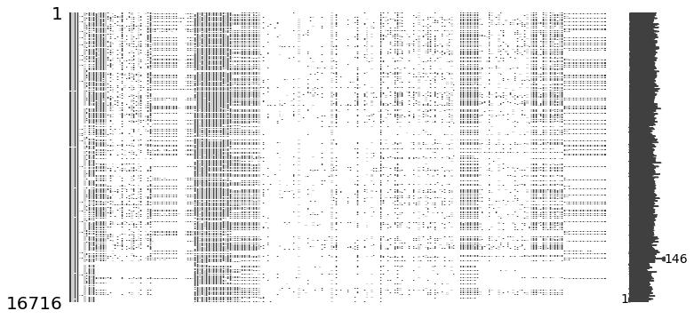


 - 총 290개의 질문(객관식 228개, 주관식 62개)에 대해 응답하지 않은 질문 다수
***

## 설문통계
 - 성별


```python
sns.countplot(y='GenderSelect', data=mcq)
```


    <matplotlib.axes._subplots.AxesSubplot at 0x12e25338748>


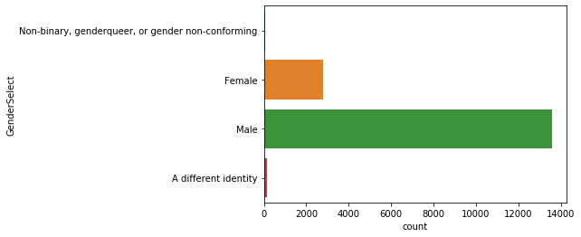


 - 국가별 응답 수


```python
country_df = pd.DataFrame(mcq['Country'].value_counts())
country_df['국가'] = country_df.index
country_df.columns = ['응답 수', '국가']

# reset_index : 기존의 행 인덱스 제거
country_df = country_df.reset_index().drop('index', axis=1)
country_df.head(20)
```


<div>
<style scoped>
    .dataframe tbody tr th:only-of-type {
        vertical-align: middle;
    }

    .dataframe tbody tr th {
        vertical-align: top;
    }

    .dataframe thead th {
        text-align: right;
    }
</style>
<table border="1" class="dataframe">
  <thead>
    <tr style="text-align: right;">
      <th></th>
      <th>응답 수</th>
      <th>국가</th>
    </tr>
  </thead>
  <tbody>
    <tr>
      <td>0</td>
      <td>4197</td>
      <td>United States</td>
    </tr>
    <tr>
      <td>1</td>
      <td>2704</td>
      <td>India</td>
    </tr>
    <tr>
      <td>2</td>
      <td>1023</td>
      <td>Other</td>
    </tr>
    <tr>
      <td>3</td>
      <td>578</td>
      <td>Russia</td>
    </tr>
    <tr>
      <td>4</td>
      <td>535</td>
      <td>United Kingdom</td>
    </tr>
    <tr>
      <td>5</td>
      <td>471</td>
      <td>People 's Republic of China</td>
    </tr>
    <tr>
      <td>6</td>
      <td>465</td>
      <td>Brazil</td>
    </tr>
    <tr>
      <td>7</td>
      <td>460</td>
      <td>Germany</td>
    </tr>
    <tr>
      <td>8</td>
      <td>442</td>
      <td>France</td>
    </tr>
    <tr>
      <td>9</td>
      <td>440</td>
      <td>Canada</td>
    </tr>
    <tr>
      <td>10</td>
      <td>421</td>
      <td>Australia</td>
    </tr>
    <tr>
      <td>11</td>
      <td>320</td>
      <td>Spain</td>
    </tr>
    <tr>
      <td>12</td>
      <td>277</td>
      <td>Japan</td>
    </tr>
    <tr>
      <td>13</td>
      <td>254</td>
      <td>Taiwan</td>
    </tr>
    <tr>
      <td>14</td>
      <td>238</td>
      <td>Italy</td>
    </tr>
    <tr>
      <td>15</td>
      <td>205</td>
      <td>Netherlands</td>
    </tr>
    <tr>
      <td>16</td>
      <td>196</td>
      <td>Ukraine</td>
    </tr>
    <tr>
      <td>17</td>
      <td>194</td>
      <td>South Korea</td>
    </tr>
    <tr>
      <td>18</td>
      <td>184</td>
      <td>Poland</td>
    </tr>
    <tr>
      <td>19</td>
      <td>184</td>
      <td>Singapore</td>
    </tr>
  </tbody>
</table>
</div>


 - 연령


```python
mcq['Age'].describe()
```


    count    16385.000000
    mean        32.372841
    std         10.473487
    min          0.000000
    25%         25.000000
    50%         30.000000
    75%         37.000000
    max        100.000000
    Name: Age, dtype: float64


```python
plt.figure(figsize=(10,6))
sns.distplot(mcq[mcq['Age']>0]['Age'])
```


    <matplotlib.axes._subplots.AxesSubplot at 0x12e293ac588>


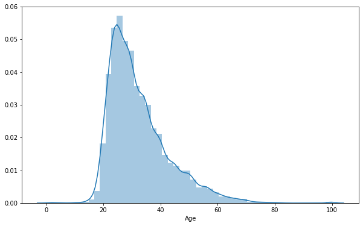


***
## 학력


```python
plt.figure(figsize=(6,5))
sns.countplot(y='FormalEducation', data=mcq)
```


    <matplotlib.axes._subplots.AxesSubplot at 0x12e281bb748>


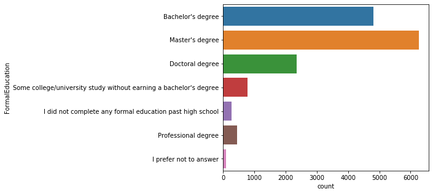


 - 박사 학위 < 학사 학위 < 석사 학위

***
## 전공


```python
# value_count에서 normalize=True 사용 시 해당 데이터의 비율 알 수 있음
mcq_major_count = pd.DataFrame(mcq['MajorSelect'].value_counts())
mcq_major_percent = pd.DataFrame(mcq['MajorSelect'].value_counts(normalize=True))*100

mcq_major_df = mcq_major_count.merge(mcq_major_percent,
                                    left_index=True, right_index=True)
mcq_major_df.columns = ['응답 수', '비율(%)']
mcq_major_df
```


<div>
<style scoped>
    .dataframe tbody tr th:only-of-type {
        vertical-align: middle;
    }

    .dataframe tbody tr th {
        vertical-align: top;
    }

    .dataframe thead th {
        text-align: right;
    }
</style>
<table border="1" class="dataframe">
  <thead>
    <tr style="text-align: right;">
      <th></th>
      <th>응답 수</th>
      <th>비율(%)</th>
    </tr>
  </thead>
  <tbody>
    <tr>
      <td>Computer Science</td>
      <td>4397</td>
      <td>33.107447</td>
    </tr>
    <tr>
      <td>Mathematics or statistics</td>
      <td>2220</td>
      <td>16.715609</td>
    </tr>
    <tr>
      <td>Engineering (non-computer focused)</td>
      <td>1339</td>
      <td>10.082072</td>
    </tr>
    <tr>
      <td>Electrical Engineering</td>
      <td>1303</td>
      <td>9.811008</td>
    </tr>
    <tr>
      <td>Other</td>
      <td>848</td>
      <td>6.385061</td>
    </tr>
    <tr>
      <td>Physics</td>
      <td>830</td>
      <td>6.249529</td>
    </tr>
    <tr>
      <td>Information technology, networking, or system administration</td>
      <td>693</td>
      <td>5.217981</td>
    </tr>
    <tr>
      <td>A social science</td>
      <td>531</td>
      <td>3.998193</td>
    </tr>
    <tr>
      <td>Biology</td>
      <td>274</td>
      <td>2.063098</td>
    </tr>
    <tr>
      <td>Management information systems</td>
      <td>237</td>
      <td>1.784504</td>
    </tr>
    <tr>
      <td>A humanities discipline</td>
      <td>198</td>
      <td>1.490852</td>
    </tr>
    <tr>
      <td>A health science</td>
      <td>152</td>
      <td>1.144492</td>
    </tr>
    <tr>
      <td>Psychology</td>
      <td>137</td>
      <td>1.031549</td>
    </tr>
    <tr>
      <td>I never declared a major</td>
      <td>65</td>
      <td>0.489421</td>
    </tr>
    <tr>
      <td>Fine arts or performing arts</td>
      <td>57</td>
      <td>0.429185</td>
    </tr>
  </tbody>
</table>
</div>


```python
plt.figure(figsize=(6,8))
sns.countplot(y='MajorSelect', data=mcq)
```


    <matplotlib.axes._subplots.AxesSubplot at 0x12e293bac88>


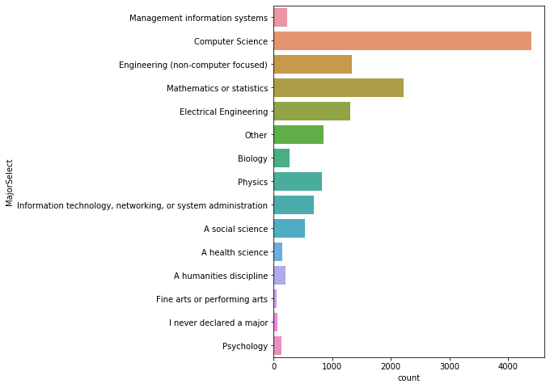


***
## 취업 여부


```python
mcq_es_count = pd.DataFrame(mcq['EmploymentStatus'].value_counts())
mcq_es_percent = pd.DataFrame(mcq['EmploymentStatus'].value_counts(normalize=True))*100
mcq_es_df = mcq_es_count.merge(mcq_es_percent,
                              left_index=True, right_index=True)

mcq_es_df.columns = ['응답 수', '비율(%)']
mcq_es_df
```


<div>
<style scoped>
    .dataframe tbody tr th:only-of-type {
        vertical-align: middle;
    }

    .dataframe tbody tr th {
        vertical-align: top;
    }

    .dataframe thead th {
        text-align: right;
    }
</style>
<table border="1" class="dataframe">
  <thead>
    <tr style="text-align: right;">
      <th></th>
      <th>응답 수</th>
      <th>비율(%)</th>
    </tr>
  </thead>
  <tbody>
    <tr>
      <td>Employed full-time</td>
      <td>10897</td>
      <td>65.189040</td>
    </tr>
    <tr>
      <td>Not employed, but looking for work</td>
      <td>2110</td>
      <td>12.622637</td>
    </tr>
    <tr>
      <td>Independent contractor, freelancer, or self-employed</td>
      <td>1330</td>
      <td>7.956449</td>
    </tr>
    <tr>
      <td>Not employed, and not looking for work</td>
      <td>924</td>
      <td>5.527638</td>
    </tr>
    <tr>
      <td>Employed part-time</td>
      <td>917</td>
      <td>5.485762</td>
    </tr>
    <tr>
      <td>I prefer not to say</td>
      <td>420</td>
      <td>2.512563</td>
    </tr>
    <tr>
      <td>Retired</td>
      <td>118</td>
      <td>0.705911</td>
    </tr>
  </tbody>
</table>
</div>


```python
plt.figure(figsize=(6,5))
sns.countplot(y='EmploymentStatus', data=mcq)
```


    <matplotlib.axes._subplots.AxesSubplot at 0x12e25e67d08>


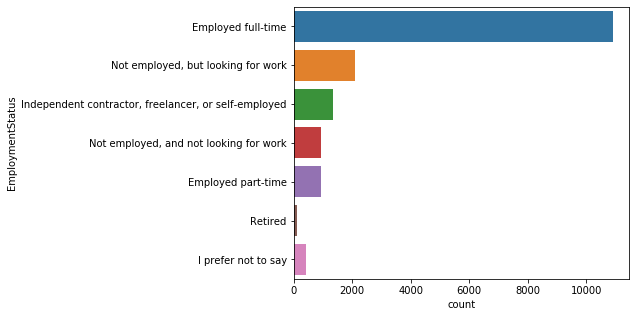


 - 응답자의 대부분(65%)이 풀타임으로 근무
***
## 프로그래밍 경험


```python
sns.countplot(y='Tenure', data=mcq)
```


    <matplotlib.axes._subplots.AxesSubplot at 0x12e2631cc88>


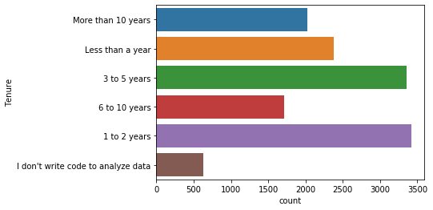


 - 우리나라 기준


```python
korea = mcq[mcq['Country'] == 'South Korea']
title = 'The number of interviewees in Korea : ' + str(korea.shape[0])

plt.figure(figsize=(10, 6))
sns.distplot(korea['Age'].dropna())
plt.title(title)
plt.show()
```


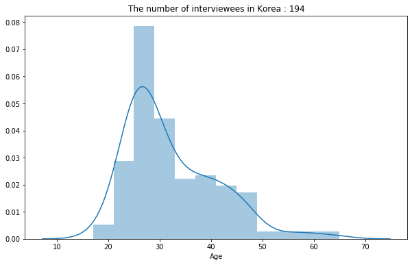


```python
pd.DataFrame(korea['GenderSelect'].value_counts())
```


<div>
<style scoped>
    .dataframe tbody tr th:only-of-type {
        vertical-align: middle;
    }

    .dataframe tbody tr th {
        vertical-align: top;
    }

    .dataframe thead th {
        text-align: right;
    }
</style>
<table border="1" class="dataframe">
  <thead>
    <tr style="text-align: right;">
      <th></th>
      <th>GenderSelect</th>
    </tr>
  </thead>
  <tbody>
    <tr>
      <td>Male</td>
      <td>156</td>
    </tr>
    <tr>
      <td>Female</td>
      <td>37</td>
    </tr>
    <tr>
      <td>A different identity</td>
      <td>1</td>
    </tr>
  </tbody>
</table>
</div>


```python
sns.countplot(x='GenderSelect', data=korea)
plt.title('Korean')
plt.show()
```


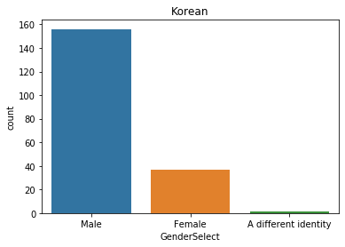


```python
figure, (ax1, ax2) = plt.subplots(ncols=2)

figure.set_size_inches(16, 6)
sns.distplot(korea['Age'].loc[korea['GenderSelect']=='Female'].dropna(),
            norm_hist=False, color=sns.color_palette('Paired')[4], ax=ax1)
ax1.title.set_text('Korean Female')

sns.distplot(korea['Age'].loc[korea['GenderSelect']=='Male'].dropna(),
            norm_hist=False, color=sns.color_palette('Paired')[0], ax=ax2)
ax2.title.set_text('Korean Male')
```


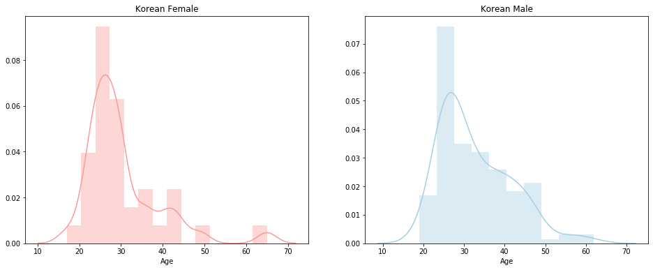


```python
plt.figure(figsize=(8,6))
sns.barplot(x=korea['EmploymentStatus'].unique(), y=korea['EmploymentStatus'].value_counts()/len(korea))
plt.xticks(rotation=30, ha='right')
plt.title('Employment status of the Korean')
plt.ylabel('')
plt.show()
```


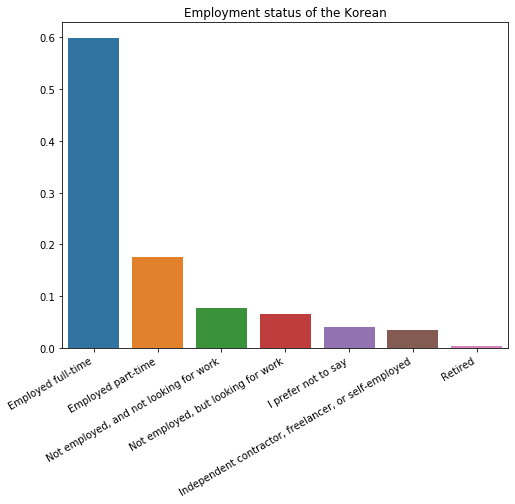


```python
korea['StudentStatus'] = korea['StudentStatus'].fillna('No')
sns.countplot(x='StudentStatus', data=korea)
plt.title('Korean')
plt.show()
```


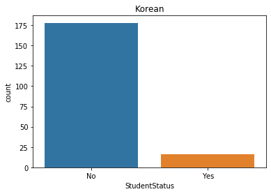

